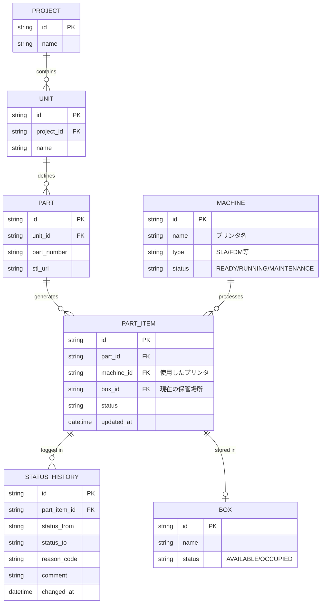

# データモデル定義書 (Draft)

## 1. エンティティ関係図 (ERD)

## 2. テーブル詳細・詳細定義

### 2.1 型定義の方針
- **ID**: 全テーブルで `UUID v7` (ソート可能なUUID) を採用。Drizzle ORM での挿入時に生成、または DB 側で生成。
- **Enum**: Postgres の `ENUM` 型として定義。

### 2.2 具体的な Enum 定義
- **PartStatus**: `PENDING`, `ACTIVE`
- **ItemStatus**: `READY`, `PRINTING`, `CUTTING`, `SANDING`, `INSPECTION`, `COMPLETED`, `SHIPPED`, `DISCARD`, `CANCELLED`
- **MachineStatus**: `READY`, `RUNNING`, `MAINTENANCE`
- **BoxStatus**: `AVAILABLE`, `OCCUPIED`
- **ReasonCode**:
    - `OPERATIONAL_ERROR`: 操作ミス（リカバリ用）
    - `QUALITY_ISSUE`: 品質不良（廃棄・戻り用）
    - `EQUIPMENT_FAILURE`: 装置故障（戻り用）
    - `ORDER_CANCEL`: 指示取消（キャンセル用）

### 2.3 テーブル詳細 (補足)
- **PartItem**: `updated_at` は `DEFAULT CURRENT_TIMESTAMP` および `ON UPDATE` で自動更新。
- **StatusHistory**: `changed_at` は履歴作成時のタイムスタンプ。

## 3. インデックス・制約
- `PartItem.status` にインデックス（ボード表示の高速化）。
- `Box.status` にインデックス（空きBox検索の高速化）。
- `Part.part_number` は `Project` 内でユニーク制約を検討（将来拡張）。
